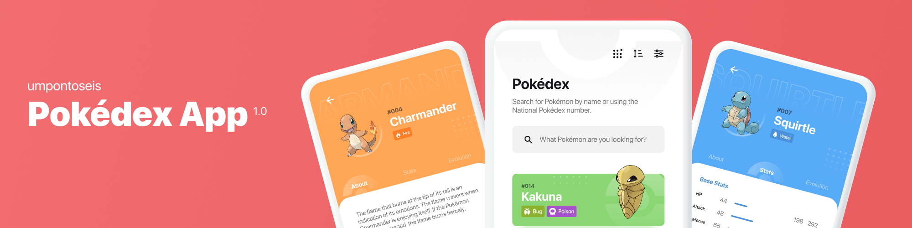

      

<h1 align="center">[DevChallenge] Desafio: Pokedex</h1>

 
<h2 align="center">Índice</h2>
   

   - [Sobre](#Sobre)
   - [Funcionalidades](#Funcionalidades)
   - [Preview](#Preview)
   - [Layout](#layout)
   - [DevChallenge](#DevChallenge)
   - [Licença](#licença)

   

 

---

 
<h2 align="center">Sobre</h2>

   App para buscar pokémons, filtrando por tipos, além de visualizar mais informações dos personagens.

O que foi usado no desenvolvimento:

- Padrão MVVM (Sem Framework)
- <a href="https://docs.microsoft.com/pt-br/xamarin/xamarin-forms/">Xamarin.Forms 5.0.0.2401</a>
- <a href="https://docs.microsoft.com/pt-br/xamarin/essentials/">Xamarin.Essentials 1.7.1</a>
- <a href="https://docs.microsoft.com/en-us/xamarin/community-toolkit/">Xamarin.Community.Toolkit 2.0.1</a>
- <a href="https://flurl.dev/"> Flurl (Requisições HTTP)</a>
- <a href="https://github.com/mbdavid/LiteDB">LiteDB (Armazenar Dados)</a>
- <a href="https://github.com/HorusSoftwareUY/Xamarin.Forms.Skeleton">Skeleton</a>
- <a href="https://github.com/rotorgames/Rg.Plugins.Popup">Rg.Plugins.Popup</a>
- <a href="https://github.com/sthewissen/Xamarin.Forms.PancakeView">PancakeView</a>
- <a href="https://github.com/mgierlasinski/MagicGradients">MagicGradients</a>
- <a href="https://github.com/luberda-molinet/FFImageLoading">FFImageLoading</a>

Dados:
- <a href="https://pokeapi.co/docs/v2">PokeAPI</a>
- <a href="https://www.pokemon.com/br/pokedex/">Pokedex Oficial</a>
- <a href="https://pokemondb.net/">Pokemon DB</a>

 

---

 
<h2 align="center">Funcionalidades</h2>

- Tela inicial listando todos os pokemons (Collectionview Infinite Scrolling)
- Filtros, podendo ser por: tipos, fraquezas, alturas, pesos e quantitativo de números (Apenas Visual)
- Opção para ordenar por ordem alfabética ou numeração
- Filtro por gerações de pokemons
- Ao clicar em um personagem, o usuário será redirecionado para o perfil do mesmo, onde conterá mais informações como dados de treinamento, inicadores, tipos de defesa e evoluções.

 

---

 
<h2 align="center">Preview</h2>

- <h3>Screenshots</h3>
   
   
   
   
   
   
   

- <h3>Gifs</h3>
   
   
   
   
   
   

 

---

 
<h2 align="center">Layout</h2>

   

      
   

   

      Layout desenvolvido por <a href="https://www.figma.com/@flaviofpsj">Flavio Farias</a>, para acessar no Figma:
   
   - <a href="https://www.figma.com/file/THLxZSlOoUYMZrjFg0Kl1M/Pok%C3%A9dex?node-id=18241%3A2789">Pokedex</a>
   

 

---

 
<h2 align="center">DevChallenge</h2>

   <a href="https://www.devchallenge.com.br/"> DevChallenge</a> permite que você evolua suas skills como programador! Participe da <a href="https://discord.gg/yvYXhGj">comunidade</a>

 

---

 
 
<h2 align="center">Licença</h2>

   Este repositório está sob licença MIT. Você pode ver o arquivo <a href=https://github.com/ErickSilva2605/xamarinforms-pokedex/blob/main/LICENSE">LICENSE</a> para mais detalhes.

 

---

   

